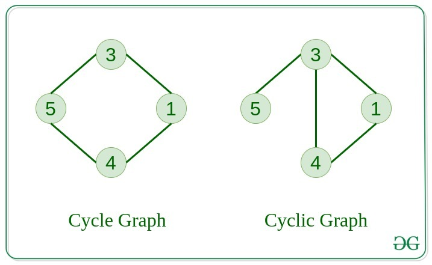

# Graph Data Structure

- Introduction to Graph Data Structure[[Link](https://www.geeksforgeeks.org/introduction-to-graphs-data-structure-and-algorithm-tutorials/)]

## What is Graph Data Structure

- A non-linear data structure consisting of vertices and edges.
- Formally, a Graph is composed of a set of vertices(V) and a set of edges(E).
- Graph is denoted by G(V, E)
- Componentes:
    - __Vertices:__ 
        - Fundamental units of the graph
        - Also known as vertex or nodes.
        - Every node/vertex can be labelled or unlabelled
    - __Edges:__
        - Are drawn or used to connect two nodes of the graph
        - Can be ordered pair of nodes in a direct graph
        - Can connect any two nodes in any possible way
        - No rules
        - Edges are also known as arcs
        - Every edge can be labelled or unlabelled
    
## Type of Graphs in DSA

1. __Null Graph__
    - there are no edges in the graph
2. __Trivial Graph__
    - graph only have a single vertex


3. __Undirected Graph__
    - graph does not have any direction.
    - nodes are unordered pairs in the definition of every edge
4. __Direct Graph__
    - graph has direction
    - nodes are ordered pairs in the definition of every edge


5. __Connected Graph__
    - graph in which from one node can visit any other node
6. __Disconnected Graph__
    - graph in which at least one node is not reachable


7. __Regular Graph__
    - graph in which the degree of every vertex is equal to K
    - each vertex has same number of neighbors
    - a regular graph can be disconnected
8. __Complete Graph__
    - graph in which from each node there is an edge to each other node
    - the example below is also 3 regular graph


9. __Cycle Graph__
    - graph in which the graph is a cycle in itself
    - minimum value of degree of each vertex is 2
10. __Cyclic Graph__
    - graph containing at least one cycle


11. __Directed Acyclic Graph__
    - a directed graph that does not contain any cycle
12. __Bipartite Graph__
    - a graph in which vertex can be divided into two sets
    - each set does not contain any edge between edge between them


13. __Weighted Graph__
- graph in which the edges are already specified with suitable weight
- can be further classified as directed weight graphs and undirected weighted graphs

## Representation of Graph
- Adjacency Matrix[[Link](https://www.geeksforgeeks.org/adjacency-matrix/)]
- Adjacency List[[Link](https://www.geeksforgeeks.org/adjacency-list-meaning-definition-in-dsa/)]
- More detailed explaination[[Link](https://www.youtube.com/watch?v=4jyESQDrpls)]

__Comparison between Adjacency Matrix and Adjacency List__
- Adding Edge:
    - Adjacency Matrix: O(1)
    - Adjacency List: O(1)
- Removing an Edge:
    - Adjacency Matrix: O(1)
    - Adjacency List: O(n)
- Initializing:
    - Adjacency Matrix: O(n^2)
    - Adjacency List: O(n)

__Difference Between Auxiliary Space and Space Complexity__
- Space Complexity: Total space used by the algorithm, including input storage and auxiliary space.
- Auxiliary Space: Extra space used by the algorithm excluding the input size.

## Basic Operations
- Insert & Delete of Nodes in the graph
    - Add & Remove in Adjacency List[[Link](https://www.geeksforgeeks.org/add-and-remove-vertex-in-adjacency-list-representation-of-graph/)]
    - Add & Remove in Adjacency Matrix[[Link](https://www.geeksforgeeks.org/add-and-remove-vertex-in-adjacency-matrix-representation-of-graph/)]
- Insert & Delete of Edges in the graph
    - Add & Remove in Adjacency List[[Link](https://www.geeksforgeeks.org/add-and-remove-edge-in-adjacency-list-representation-of-a-graph/)]
    - Add & Remove in Adjacency Matrix[[Link](https://www.geeksforgeeks.org/add-and-remove-edge-in-adjacency-matrix-representation-of-a-graph/)]
- Searching in Graph: search an entity in the graph
- Traversal of Graph: traversing all nodes in the graph


### Adding & Removing Edges Implementation (Adjacency Matrix)
```python
class Graph:
    def __init__(self, size):
        self.size = size  # Number of vertices
        self.matrix = [[0] * size for _ in range(size)]  # NxN adjacency matrix

    def add_edge(self, u, v, weight=1, directed=False):
        """Adds an edge between u and v (weighted or unweighted, directed or undirected)"""
        self.matrix[u][v] = weight
        if not directed:
            self.matrix[v][u] = weight  # If undirected, update both cells

    def remove_edge(self, u, v, directed=False):
        """Removes the edge between u and v"""
        self.matrix[u][v] = 0
        if not directed:
            self.matrix[v][u] = 0  # Remove both for undirected graph

    def display(self):
        """Prints the adjacency matrix"""
        for row in self.matrix:
            print(row)
```

### Adding & Removing Vertexs Implementation (Adjacency Matrix)
```python
def add_vertex(graph):
    graph.size += 1  # Increase the number of vertices
    new_size = graph.size
    
    # Create a new (size+1)x(size+1) matrix with all values initialized to 0
    new_matrix = [[0] * new_size for _ in range(new_size)]

    # Copy old adjacency matrix values into the new matrix
    for i in range(new_size - 1):
        for j in range(new_size - 1):
            new_matrix[i][j] = graph.matrix[i][j]

    # Update the graph with the new matrix
    graph.matrix = new_matrix


def remove_vertex(graph, vertex):
    graph.size -= 1  # Reduce the number of vertices
    new_size = graph.size

    # Create a new (size-1)x(size-1) matrix
    new_matrix = [[0] * new_size for _ in range(new_size)]

    # Copy values except the row and column of the vertex being removed
    row_offset, col_offset = 0, 0
    for i in range(new_size + 1):  # Old matrix size
        if i == vertex: 
            row_offset = 1  # Skip this row
            continue
        col_offset = 0
        for j in range(new_size + 1):
            if j == vertex:
                col_offset = 1  # Skip this column
                continue
            new_matrix[i - row_offset][j - col_offset] = graph.matrix[i][j]

    # Update the graph with the new matrix
    graph.matrix = new_matrix
```

### In Adjacency List
```python
class Graph:
    def __init__(self):
        self.adj_list = {}  # Dictionary to store adjacency list

    def add_vertex(self, v):
        """Adds a new vertex to the graph."""
        if v not in self.adj_list:
            self.adj_list[v] = []  # Initialize with an empty list

    def remove_vertex(self, v):
        """Removes a vertex and all its edges."""
        if v in self.adj_list:
            # Remove the vertex from other adjacency lists
            for neighbor in list(self.adj_list[v]):
                self.adj_list[neighbor].remove(v)
            # Remove the vertex itself
            del self.adj_list[v]

    def add_edge(self, u, v, directed=False):
        """Adds an edge between u and v."""
        if u not in self.adj_list:
            self.add_vertex(u)
        if v not in self.adj_list:
            self.add_vertex(v)
        
        self.adj_list[u].append(v)
        if not directed:
            self.adj_list[v].append(u)

    def remove_edge(self, u, v, directed=False):
        """Removes the edge between u and v."""
        if u in self.adj_list and v in self.adj_list[u]:
            self.adj_list[u].remove(v)
        if not directed and v in self.adj_list and u in self.adj_list[v]:
            self.adj_list[v].remove(u)

    def display(self):
        """Displays the adjacency list."""
        for vertex, neighbors in self.adj_list.items():
            print(f"{vertex}: {neighbors}")

# Example Usage
g = Graph()
g.add_edge(0, 1)
g.add_edge(0, 2)
g.add_edge(1, 3)
g.add_edge(2, 3)
print("Graph after adding edges:")
g.display()

# Remove an edge
g.remove_edge(0, 1)
print("\nGraph after removing edge (0,1):")
g.display()

# Add a new vertex
g.add_vertex(4)
print("\nGraph after adding vertex 4:")
g.display()

# Remove a vertex
g.remove_vertex(2)
print("\nGraph after removing vertex 2:")
g.display()

```

## Difference between Tree and Graph
- Tree is a restricted type of graph data structure, just with some more rules
- Every tree will always be a graph but not all graphs will be trees
- LinkedList, Trees, and Heaps are all special cases of graphs

## Pros & Cons of Graph
- __Pros:__
    - Graph Data Structure used to represent a wide range of relationships as we do not have any restrictions like previous data structures (Tree cannot have loops and have to be hierarchical. Arrays, Linked List, etc are linear)
    - They can be used to model and solve a wide range of problems, including pathfinding, data clustering, network analysis, and machine learning.
    - Any real world problem where we certain set of items and relations between them can be easily modeled as a graph and a lot of standard graph algorithms like BFS, DFS, Spanning Tree, Shortest Path, Topological Sorting and Strongly Connected
    - Graph Data Structure can be used to represent complex data structures in a simple and intuitive way, making them easier to understand and analyze.
- __Cons:__
    - Graph Data Structure can be complex and difficult to understand, especially for people who are not familiar with graph theory or related algorithms.
    - Creating and manipulating graphs can be computationally expensive, especially for very large or complex graphs.
    - Graph algorithms can be difficult to design and implement correctly, and can be prone to bugs and errors.
    - Graph Data Structure can be difficult to visualize and analyze, especially for very large or complex graphs, which can make it challenging to extract meaningful insights from the data.